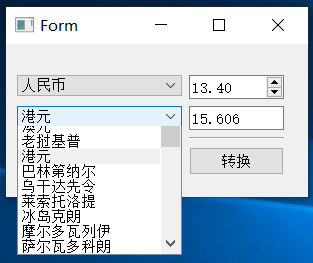
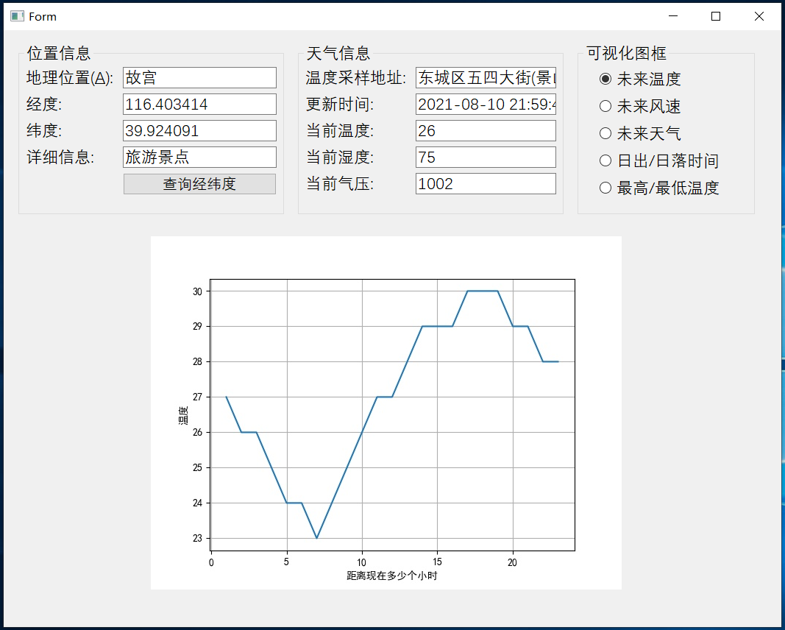

# PyQt5项目实战

## 汇率计算器

本项目提供PyQt5编程通用的项目工程模板，用于将界面与逻辑分离。其使用方法详见[main.py]()中的注释部分。

## 汇率计算器

本项目的主要功能是实时获取每天的汇率，并提供一套完整的计算工具完成不同币种之间的汇率转换。项目代码详见[code](https://github.com/wzy6642/PyQt5/blob/master/%E5%AE%9E%E6%97%B6%E6%B1%87%E7%8E%87%E6%8D%A2%E7%AE%97/run.py)，具体效果为：

## 天气查询

本项目借助百度正逆地理编码API以及天气状况查询API实现输入地名，获取其经纬度以及当前天气状况，并将未来一段时间的温度等信息以曲线图的形式进行展示。项目代码详见[code](https://github.com/wzy6642/PyQt5/blob/master/%E5%A4%A9%E6%B0%94%E6%9F%A5%E8%AF%A2/run.py)，具体效果为：

