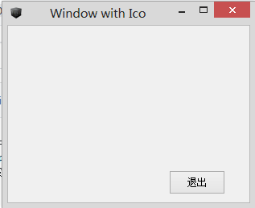
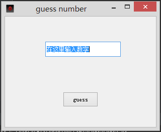

# PyQt5
记录PyQt5学习过程中的点点滴滴
### [day1](day1.py)
利用Slider模块改变LCD模块数值，最终的展示效果如下图所示

### [day2](day2/day2.py)
给窗口添加LOGO，并创建按钮，通过按钮关闭窗口。最终展示效果如下图所示

### [day3](day3/day3.py)
制作一个猜数字的小游戏，随机生成1~100的随机数让用户猜，并针对猜测结果给出判断。最终展示效果如下图所示

